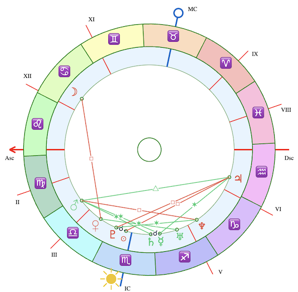

# AstroNatalChart



Lightweight **vanilla JavaScript SVG renderer** for drawing astrological natal charts in the browser.
No dependencies, no jQuery, and ready for **npm installation**.

The library renders a classic circular horoscope chart including:

* Zodiac ring
* Planet ring
* Houses (I–XII)
* Ascendant / Descendant axis
* MC / IC axis
* Aspect lines
* Planet symbols with collision avoidance
* Aspect-based coloring of planets
* Optional **second set of planets** (synastry / transit style)
* SVG output for sharp rendering at any size

---

## Live Demo

https://bfhp.github.io/astro-natal-chart/

---

# Features

✔ Pure **vanilla JS**
✔ **SVG rendering** (no canvas)
✔ **Responsive scaling**
✔ Planet **collision avoidance**
✔ Classical **aspect calculation**
✔ Planet **coloring by strongest aspect**
✔ Optional **second planet set (synastry / transits)**
✔ Customizable **colors and labels**
✔ Works in **modern browsers without frameworks**

---

# Responsive Design

The chart is **fully responsive**.

It automatically adapts to the **width of its container** using SVG scaling.
The chart is rendered once and then smoothly scales to any size without recalculating geometry.

This makes it suitable for:
* responsive layouts
* mobile devices
* orientation changes (phone / tablet rotation)
* flexible containers (flexbox / grid)

Example:
```html
<div id="chart" style="max-width:600px;"></div>
#chart {
  width: 100%;
}
```

The chart will automatically scale to the container width while maintaining a **perfect square aspect ratio**.

---

# Installation

```bash
npm install @bfhp/astro-natal-chart
```

or include directly:

```html
<script type="module">
    import AstroNatalChart from "./astro-natal-chart.js"
</script>
```

---

# Basic Usage

```javascript
import AstroNatalChart from "@bfhp/astro-natal-chart"

const data = {
  cusps: [147, 166, 192, 225, 264, 299, 327, 346, 12, 45, 84, 119],

  planets: {
    Sun: 221,
    Moon: 110,
    Mercury: 244,
    Venus: 202,
    Mars: 184,
    Jupiter: 308,
    Saturn: 238,
    Uranus: 256,
    Neptune: 271,
    Pluto: 214
  }
}

new AstroNatalChart("#chart", data)
```

HTML:

```html
<div id="chart" style="max-width:600px;"></div>
```

---

# Synastry / Transits

You can optionally provide a **second set of planets**.

When two sets are provided:

* planets from both sets are drawn
* **aspects are calculated only between sets**
* symbols are automatically spaced to avoid collisions

Example:

```javascript
new AstroNatalChart("#chart", {
  cusps,

  planets: {
    Sun: 221,
    Moon: 110,
    Mercury: 244,
    Venus: 202,
    Mars: 184,
    Jupiter: 308,
    Saturn: 238,
    Uranus: 256,
    Neptune: 271,
    Pluto: 214
  },

  planets2: {
    Sun: 120,
    Moon: 87,
    Mercury: 130,
    Venus: 150,
    Mars: 210,
    Jupiter: 300,
    Saturn: 260,
    Uranus: 250,
    Neptune: 270,
    Pluto: 220
  }
})
```

If `planets2` is **not provided**, aspects are calculated **within the single set** (standard natal chart).

---

# Data Format

## Cusps

House cusps must be provided in **absolute zodiac degrees (0–360°)**.

Example:

```javascript
cusps: [
  147, // I
  166, // II
  192, // III
  225, // IV
  264, // V
  299, // VI
  327, // VII
  346, // VIII
  12,  // IX
  45,  // X (MC)
  84,  // XI
  119  // XII
]
```

Ascendant is automatically taken from **house I**.

---

## Planets

Planet positions must be provided as **absolute zodiac longitude (0–360°)**.

```javascript
planets: {
  Sun: 221.5,
  Moon: 110.1,
  Mercury: 244.0,
  Venus: 202.9,
  Mars: 184.6,
  Jupiter: 308.7,
  Saturn: 238.4,
  Uranus: 256.1,
  Neptune: 271.6,
  Pluto: 214.9
}
```

Supported planets:

```
Sun
Moon
Mercury
Venus
Mars
Jupiter
Saturn
Uranus
Neptune
Pluto
```

---

# Aspects

Supported classical aspects:

| Aspect      | Angle |
| ----------- | ----- |
| Conjunction | 0°    |
| Sextile     | 60°   |
| Square      | 90°   |
| Trine       | 120°  |
| Opposition  | 180°  |

Default orbs:

| Aspect      | Orb |
| ----------- | --- |
| Conjunction | 8°  |
| Sextile     | 6°  |
| Square      | 6°  |
| Trine       | 6°  |
| Opposition  | 8°  |

Planets are colored according to their **strongest (tightest) aspect**.

Typical colors:

```
Conjunction  — dark
Sextile      — green
Trine        — green
Square       — red
Opposition   — red
```

---

# Rendering Layers

The chart is drawn using layered SVG elements:

1. Planet ring background
2. House lines
3. Asc/Dsc axis
4. MC/IC axis
5. Aspect background mask
6. Planet dots
7. Aspect lines
8. Zodiac ring
9. Planet symbols
10. Center circle
11. Sun symbol outside the zodiac ring

---

# Collision Avoidance

If several planets are close in longitude (stellium), the renderer automatically:

* detects overlaps
* slightly shifts planets along the orbit
* preserves planetary order

This keeps the chart readable without distorting astrological geometry.

---

# Customization

You can override colors and labels.

Example:

```javascript
new AstroNatalChart("#chart", {

  cusps,
  planets,

  colors: {
    border: "#006600",
    asc: "#ff0000",
    mc: "#0000ff",
    text: "#222"
  },

  lang: {
    asc: "Asc",
    dsc: "Dsc",
    mc: "MC",
    ic: "IC",

    planets: {
      Sun: "Sun",
      Moon: "Moon",
      Mercury: "Mercury",
      Venus: "Venus",
      Mars: "Mars",
      Jupiter: "Jupiter",
      Saturn: "Saturn",
      Uranus: "Uranus",
      Neptune: "Neptune",
      Pluto: "Pluto",
    }
  }

})
```

---

# Browser Support

Works in all modern browsers supporting:

* ES modules
* SVG
* modern DOM APIs

Tested in:

* Chrome
* Firefox
* Safari
* Edge

---

# License

MIT License
